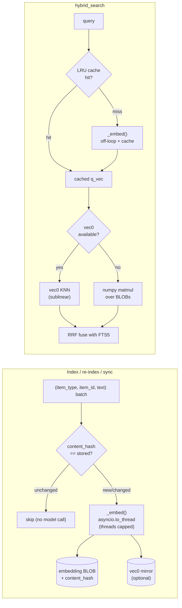

# MemoPad Architecture

This document describes the architectural patterns and composition structure of MemoPad.

## Overview

MemoPad is a local-first knowledge management system with three entrypoints:
- **API** - FastAPI REST server for HTTP access
- **MCP** - Model Context Protocol server for LLM integration
- **CLI** - Typer command-line interface

Each entrypoint uses a **composition root** pattern to manage configuration and dependencies.

## Composition Roots

### What is a Composition Root?

A composition root is the single place in an application where dependencies are wired together. In MemoPad, each entrypoint has its own composition root that:

1. Reads configuration from `ConfigManager`
2. Resolves runtime mode (cloud/local/test)
3. Creates and provides dependencies to downstream code

**Key principle**: Only composition roots read global configuration. All other modules receive configuration explicitly.

### Container Structure

Each entrypoint has a container dataclass in its package:

```
src/memopad/
├── api/
│   └── container.py      # ApiContainer
├── mcp/
│   └── container.py      # McpContainer
├── cli/
│   └── container.py      # CliContainer
└── runtime.py            # RuntimeMode enum and resolver
```

### Container Pattern

All containers follow the same structure:

```python
@dataclass
class Container:
    config: BasicMemoryConfig
    mode: RuntimeMode

    @classmethod
    def create(cls) -> "Container":
        """Create container by reading ConfigManager."""
        config = ConfigManager().config
        mode = resolve_runtime_mode(
            cloud_mode_enabled=config.cloud_mode_enabled,
            is_test_env=config.is_test_env,
        )
        return cls(config=config, mode=mode)

    @property
    def some_computed_property(self) -> bool:
        """Derived values based on config and mode."""
        return self.mode.is_local and self.config.some_setting

# Module-level singleton
_container: Container | None = None

def get_container() -> Container:
    if _container is None:
        raise RuntimeError("Container not initialized")
    return _container

def set_container(container: Container) -> None:
    global _container
    _container = container
```

### Runtime Mode Resolution

The `RuntimeMode` enum centralizes mode detection:

```python
class RuntimeMode(Enum):
    LOCAL = "local"
    CLOUD = "cloud"
    TEST = "test"

    @property
    def is_cloud(self) -> bool:
        return self == RuntimeMode.CLOUD

    @property
    def is_local(self) -> bool:
        return self == RuntimeMode.LOCAL

    @property
    def is_test(self) -> bool:
        return self == RuntimeMode.TEST
```

Resolution follows this precedence: **TEST > CLOUD > LOCAL**

```python
def resolve_runtime_mode(cloud_mode_enabled: bool, is_test_env: bool) -> RuntimeMode:
    if is_test_env:
        return RuntimeMode.TEST
    if cloud_mode_enabled:
        return RuntimeMode.CLOUD
    return RuntimeMode.LOCAL
```

## Dependencies Package

### Structure

The `deps/` package provides FastAPI dependencies organized by feature:

```
src/memopad/deps/
├── __init__.py       # Re-exports for backwards compatibility
├── config.py         # Configuration access
├── db.py             # Database/session management
├── projects.py       # Project resolution
├── repositories.py   # Data access layer
├── services.py       # Business logic layer
└── importers.py      # Import functionality
```

### Usage in Routers

```python
from memopad.deps.services import get_entity_service
from memopad.deps.projects import get_project_config

@router.get("/entities/{id}")
async def get_entity(
    id: int,
    entity_service: EntityService = Depends(get_entity_service),
    project: ProjectConfig = Depends(get_project_config),
):
    return await entity_service.get(id)
```

### Backwards Compatibility

The old `deps.py` file still exists as a thin re-export shim:

```python
# deps.py - backwards compatibility shim
from memopad.deps import *
```

New code should import from specific submodules (`memopad.deps.services`) for clarity.

## MCP Tools Architecture

### Typed API Clients

MCP tools communicate with the API through typed clients that encapsulate HTTP paths and response validation:

```
src/memopad/mcp/clients/
├── __init__.py       # Re-exports all clients
├── base.py           # BaseClient with common logic
├── knowledge.py      # KnowledgeClient - entity CRUD
├── search.py         # SearchClient - search operations
├── memory.py         # MemoryClient - context building
├── directory.py      # DirectoryClient - directory listing
├── resource.py       # ResourceClient - resource reading
└── project.py        # ProjectClient - project management
```

### Client Pattern

Each client encapsulates API paths and validates responses:

```python
class KnowledgeClient(BaseClient):
    """Client for knowledge/entity operations."""

    async def resolve_entity(self, identifier: str) -> int:
        """Resolve identifier to entity ID."""
        response = await call_get(
            self.http_client,
            f"{self._base_path}/resolve/{identifier}",
        )
        return int(response.text)

    async def get_entity(self, entity_id: int) -> EntityResponse:
        """Get entity by ID."""
        response = await call_get(
            self.http_client,
            f"{self._base_path}/entities/{entity_id}",
        )
        return EntityResponse.model_validate(response.json())
```

### Tool → Client → API Flow

```
MCP Tool (thin adapter)
    ↓
Typed Client (encapsulates paths, validates responses)
    ↓
HTTP API (FastAPI router)
    ↓
Service Layer (business logic)
    ↓
Repository Layer (data access)
```

Example tool using typed client:

```python
@mcp.tool()
async def search_notes(
    query: str,
    project: str | None = None,
    metadata_filters: dict | None = None,
    tags: list[str] | None = None,
    status: str | None = None,
) -> SearchResponse:
    async with get_client() as client:
        active_project = await get_active_project(client, project)

        # Import client inside function to avoid circular imports
        from memopad.mcp.clients import SearchClient
        from memopad.schemas.search import SearchQuery

        search_query = SearchQuery(
            text=query,
            metadata_filters=metadata_filters,
            tags=tags,
            status=status,
        )
        search_client = SearchClient(client, active_project.external_id)
        return await search_client.search(search_query.model_dump())
```

## Sync Coordination

### SyncCoordinator

The `SyncCoordinator` centralizes sync/watch lifecycle management:

```python
@dataclass
class SyncCoordinator:
    """Coordinates file sync and watch operations."""

    status: SyncStatus = SyncStatus.NOT_STARTED
    sync_task: asyncio.Task | None = None
    watch_service: WatchService | None = None

    async def start(self, ...):
        """Start sync and watch operations."""

    async def stop(self):
        """Stop all sync operations gracefully."""

    def get_status_info(self) -> dict:
        """Get current sync status for observability."""
```

### Status Enum

```python
class SyncStatus(Enum):
    NOT_STARTED = "not_started"
    STARTING = "starting"
    RUNNING = "running"
    STOPPING = "stopping"
    STOPPED = "stopped"
    ERROR = "error"
```

### File ↔ DB consistency invariants

Two invariants keep the file and database views from diverging (see
`docs/CHANGES-hardening-p0-p3.md`):

- **Cache invalidation on every mutation.** `EntityService` keeps a 2Q
  permalink cache (`_permalink_cache`, keyed `path:<file>`) and a 60 s
  metadata cache. Moves and deletes invalidate both the old and new path keys
  *around* the operation (before resolving the destination permalink, after
  the DB update succeeds), and the sync write path reads metadata with
  `use_cache=False`. `resolve_permalink` never serves a cached value when the
  markdown carries an explicit `permalink:` frontmatter field. A failed move
  restores the original permalink into the file.
- **Atomic replace via single-session repository methods.** Replacing an
  entity's observations or outgoing relations uses `replace_observations` /
  `replace_outgoing_relations` — one `db.scoped_session`, delete + insert in
  one commit — so a failure mid-replace can't leave the entity with zero
  observations/relations (the old delete-then-add-on-separate-sessions path
  committed the delete before the add). `create_entity` cleans up an
  orphaned file if upsert/reconcile raises after the write.

## Project Resolution

### ProjectResolver

Unified project selection across all entrypoints:

```python
class ProjectResolver:
    """Resolves which project to use based on context."""

    def resolve(
        self,
        explicit_project: str | None = None,
    ) -> ResolvedProject:
        """Resolve project using three-tier hierarchy:
        1. Explicit project parameter
        2. Default project from config
        3. Single available project
        """
```

### Resolution Modes

```python
class ResolutionMode(Enum):
    EXPLICIT = "explicit"           # User specified project
    DEFAULT = "default"             # Using configured default
    SINGLE_PROJECT = "single"       # Only one project exists
    FALLBACK = "fallback"           # Using first available
```

## Testing Patterns

### Container Testing

Each container has corresponding tests:

```
tests/
├── api/test_api_container.py
├── mcp/test_mcp_container.py
└── cli/test_cli_container.py
```

Tests verify:
- Container creation from config
- Runtime mode properties
- Container accessor functions (get/set)

### Mocking Typed Clients

When testing MCP tools, mock at the client level:

```python
def test_search_notes(monkeypatch):
    import memopad.mcp.clients as clients_mod

    class MockSearchClient:
        async def search(self, query):
            return SearchResponse(results=[...])

    monkeypatch.setattr(clients_mod, "SearchClient", MockSearchClient)
```

## Design Principles

### 1. Explicit Dependencies

Modules receive configuration explicitly rather than reading globals:

```python
# Good - explicit injection
async def sync_files(config: BasicMemoryConfig):
    ...

# Avoid - hidden global access
async def sync_files():
    config = ConfigManager().config  # Hidden coupling
```

### 2. Single Responsibility

Each layer has a clear responsibility:
- **Containers**: Wire dependencies
- **Clients**: Encapsulate HTTP communication
- **Services**: Business logic
- **Repositories**: Data access
- **Tools/Routers**: Thin adapters

### 3. Deferred Imports

To avoid circular imports, typed clients are imported inside functions:

```python
async def my_tool():
    async with get_client() as client:
        # Import here to avoid circular dependency
        from memopad.mcp.clients import KnowledgeClient

        knowledge_client = KnowledgeClient(client, project_id)
```

### 4. Backwards Compatibility

When refactoring, maintain backwards compatibility via shims:

```python
# Old module becomes a shim
from memopad.new_location import *

# Docstring explains migration path
"""
DEPRECATED: Import from memopad.new_location instead.
This shim will be removed in a future version.
"""
```

## File Organization

```
src/memopad/
├── api/
│   ├── container.py          # API composition root
│   ├── routers/              # FastAPI routers
│   └── ...
├── mcp/
│   ├── container.py          # MCP composition root
│   ├── clients/              # Typed API clients
│   ├── tools/                # MCP tool definitions
│   └── server.py             # MCP server setup
├── cli/
│   ├── container.py          # CLI composition root
│   ├── app.py                # Typer app
│   └── commands/             # CLI command groups
├── deps/
│   ├── config.py             # Config dependencies
│   ├── db.py                 # Database dependencies
│   ├── projects.py           # Project dependencies
│   ├── repositories.py       # Repository dependencies
│   ├── services.py           # Service dependencies
│   └── importers.py          # Importer dependencies
├── sync/
│   ├── coordinator.py        # SyncCoordinator
│   └── ...
├── runtime.py                # RuntimeMode resolution
├── project_resolver.py       # Unified project selection
└── config.py                 # Configuration management
```

## Embeddings & Semantic Search

Semantic/hybrid search is an opt-in feature (`MEMOPAD_EMBEDDINGS_ENABLED`)
layered on top of the FTS5 keyword index. `EmbeddingService`
(`services/embedding_service.py`) owns a two-tier vector store and is reached
only through `SearchService` — entity/observation/relation services never touch
it directly.

**Two-tier store**

- **Canonical BLOB store** (`embedding` table, every backend): `item_type`
  (`entity`/`observation`/`relation`) + `item_id` composite key, packed
  float32 `vector`, and a `content_hash` (SHA-256 of the embedded text). Source
  of truth; created by the `p9d1e2f3a4b5` migration (and lazily by
  `_init_blob_store`).
- **Optional `sqlite-vec` ANN index**: one `vec0` virtual table per item type
  per project mirrors the BLOB store for sublinear KNN. Table names are
  **dim-scoped** — `embedding_vec_<item_type>_p<project>_d<dim>` — so a model
  swap (different `dim`) creates its own table instead of mutating an
  existing `IF NOT EXISTS` table whose row width no longer matches; this
  prevents a wrong-dim `INSERT` from rolling back the canonical BLOB write.
  When the extension can't load, search falls back to a numpy matmul over the
  BLOB store. `db.py` loads the extension per connection (gated on the env var)
  and logs the outcome once.

**Hybrid search** fuses BM25 (FTS5) and cosine rankings via Reciprocal Rank
Fusion (RRF), keyed by `(item_type, item_id)` so entities, facts, and
relations fuse on equal footing.

**Performance design** (see `docs/CHANGES-embedding-perf.md`):



- **Off-loop inference (Fix 1):** `provider.embed` runs via `asyncio.to_thread`;
  ONNX threads capped to `MEMOPAD_EMBEDDING_THREADS` (default `min(4, cpu_count)`).
- **Content-hash dedup (Fix 2):** `upsert_batch` skips items whose text+model
  are unchanged — re-indexing unchanged content costs nothing.
- **sqlite-vec loading (Fix 3a):** aiosqlite connections drive the extension via
  `run_async`; vec0 actually loads instead of silently falling back to the
  O(N) scorer.
- **Batched sync (Fix 4):** `SearchService.begin_embedding_batch` /
  `flush_embedding_buffer` accumulate items across a sync sweep and flush in
  128-item chunks (one model call per chunk, not per file).
- **Query cache (Fix 5):** a bounded LRU (256, keyed by `(model, query)`)
  serves repeat queries without a model call.
