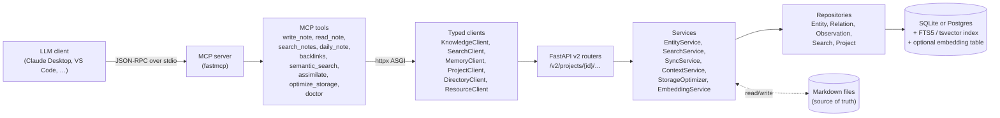
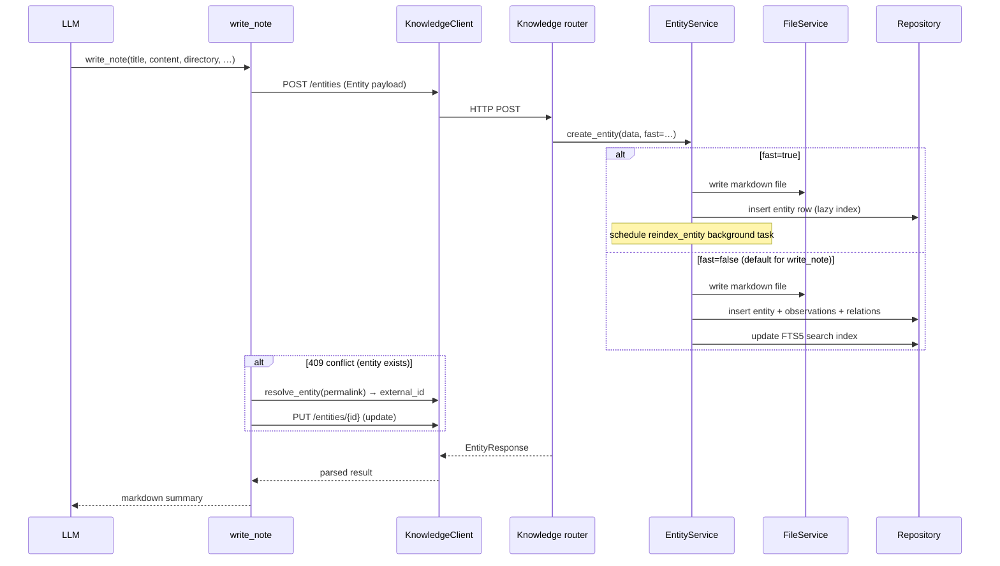
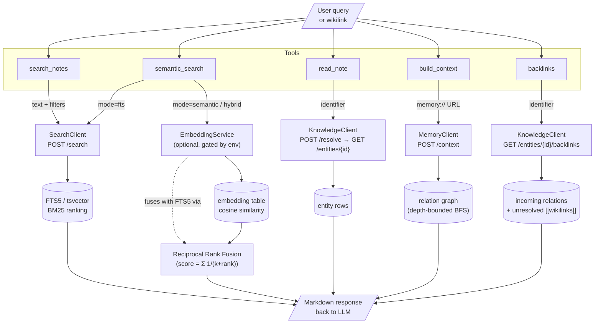
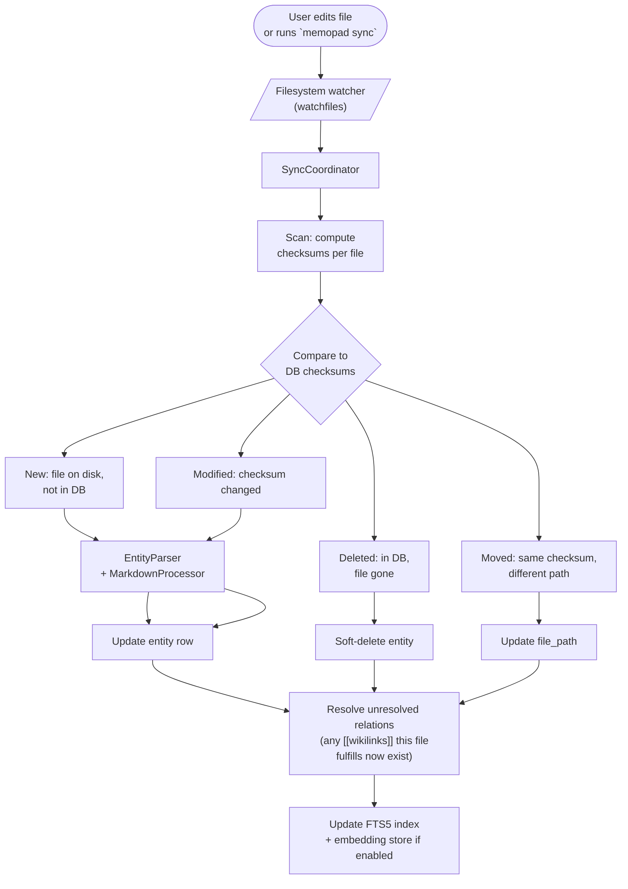
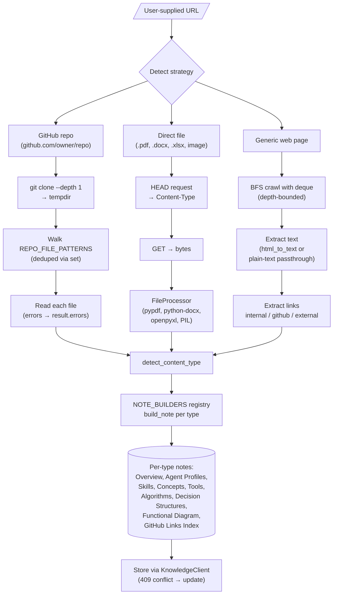
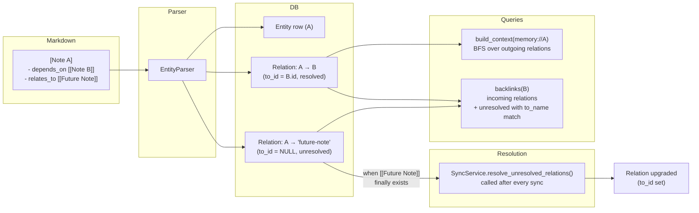
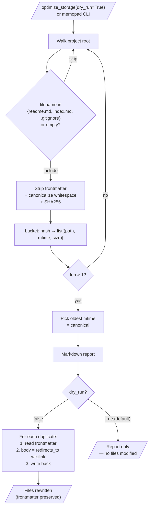
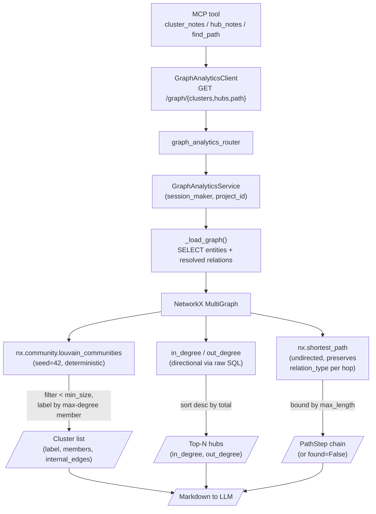
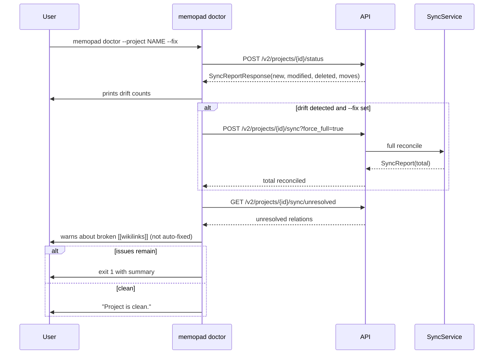

# MemoPad Workflows

Visual reference for how data and control flow through MemoPad. Diagrams use
Mermaid — GitHub renders them natively, and they round-trip cleanly into
Obsidian / Notion / VS Code's Markdown preview.

For the engineering plan and current implementation status see
[plans/PLAN.md](../plans/PLAN.md). For deeper architecture see
[ARCHITECTURE.md](ARCHITECTURE.md).

---

## 1. High-level architecture

How an LLM call lands in the right repository method.

**Key invariant:** files are the source of truth. The DB is a derived index
that sync rebuilds from disk.

---

## 2. Write flow — `write_note`

Optimistic create with conflict-aware update.

---

## 3. Read & search flows

`search_notes` (FTS5/BM25), `semantic_search` (hybrid), and `read_note`
(direct fetch) share the typed-client layer.

**Note (status):** `semantic_search` ships with the embedding service wired
up; the hybrid retrieval call back to the API still needs the
`/v2/projects/{id}/search/semantic` endpoint and a sync-time embedding hook.
See [plans/PLAN.md §2.4](../plans/PLAN.md).

---

## 4. Sync flow — files ↔ DB

The sync coordinator watches the project root and reconciles each change.

`memopad doctor --project NAME` reads the same diff from
`POST /v2/projects/{id}/status`. With `--fix`, it triggers a `force_full=true`
sync to apply the reconciliation.

---

## 5. Assimilate flow — URL → structured notes

Errors (network, decode, file-read) are now captured with their reason and
surfaced in the final summary, not silently swallowed.

---

## 6. Knowledge graph traversal

Where wikilinks come from and how they get resolved.

Backlinks include unresolved wikilinks that match the target's permalink or
title — so a brand-new note immediately shows the inbound references that
were waiting on it.

---

## 7. Storage optimization (dedupe)

Canonical-by-oldest-mtime means the original creation wins; later accidental
copies become redirect stubs.

---

## 8. Graph analytics (`cluster_notes`, `hub_notes`, `find_path`)

Three read-only operations over the relation graph, inspired by graphify but
running on MemoPad's existing wikilink-derived relations. NetworkX-backed,
no LLM calls, no embedding model required.

**Why undirected for clustering:** `depends_on` is not symmetric with
`enables`, but for "what topics are connected" questions users expect
either direction to count as a link.

**Why directional for hubs:** in/out split tells you whether a note is a
*reference* (high in_degree, things link to it) vs. an *index* (high
out_degree, it links out to many things).

**Determinism:** Louvain has a stable seed so the same vault produces the
same clusters across runs. Tied degrees in `find_hubs` break by title
ascending, also stable.

---

## 9. Doctor (`--fix` mode)

Unresolved wikilinks are reported only — auto-rewriting user content via
fuzzy matching is too risky.

---

## Updating these diagrams

Mermaid blocks are plain text. When you change a flow:

1. Edit the relevant block in this file.
2. Preview in any Mermaid-aware renderer (GitHub, Obsidian, VS Code).
3. Note the corresponding section in [plans/PLAN.md](../plans/PLAN.md) if the
   change reflects a new ✅/🚧/💭 status.
