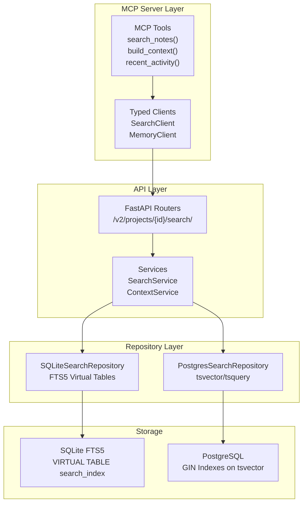

# FTS5 Analysis for MemoPad MCP Server

## Executive Summary

**MemoPad already uses SQLite FTS5** for its full-text search implementation. The project has a dual-backend architecture:
- **SQLite**: Uses FTS5 virtual tables with MATCH operator and bm25() ranking
- **PostgreSQL**: Uses tsvector/tsquery with GIN indexes and ts_rank() scoring

FTS5 significantly improves MemoPad's "memory" (the ability to retrieve relevant knowledge) through fast, ranked full-text search across entities, observations, and relations.

---

## Current FTS5 Implementation

### 1. Architecture Overview



### 2. FTS5 Configuration (SQLite)

**File**: [`src/memopad/models/search.py`](src/memopad/models/search.py:62-94)

```sql
CREATE VIRTUAL TABLE IF NOT EXISTS search_index USING fts5(
    id UNINDEXED,          -- Row ID
    title,                 -- Title for searching
    content_stems,         -- Main searchable content
    content_snippet,       -- Display snippet
    permalink,             -- Stable identifier
    file_path UNINDEXED,   -- Physical location
    type UNINDEXED,        -- entity/relation/observation
    project_id UNINDEXED,  -- Project isolation
    from_id UNINDEXED,     -- Relation source
    to_id UNINDEXED,       -- Relation target
    relation_type UNINDEXED,
    entity_id UNINDEXED,   -- Parent entity
    category UNINDEXED,    -- Observation category
    metadata UNINDEXED,    -- JSON metadata
    created_at UNINDEXED,
    updated_at UNINDEXED,
    
    -- Unicode tokenizer with '/' as token character (for path search)
    tokenize='unicode61 tokenchars 0x2F',
    -- Enable prefix matching for prefixes of length 1,2,3,4
    prefix='1,2,3,4'
);
```

### 3. Key FTS5 Features Used

| Feature | Implementation | Benefit |
|---------|---------------|---------|
| **Virtual Tables** | `USING fts5(...)` | Native full-text indexing |
| **MATCH Operator** | `title MATCH :text OR content_stems MATCH :text` | Fast boolean full-text search |
| **bm25() Ranking** | `ORDER BY bm25(search_index)` | Relevance-based result ordering |
| **Prefix Search** | `prefix='1,2,3,4'` + `term*` | Autocomplete-style matching |
| **Unicode Tokenizer** | `unicode61 tokenchars 0x2F` | Proper Unicode + path support |
| **Special Char Quoting** | `"term"` escaping | Prevents syntax errors |

---

## How FTS5 Improves MemoPad Memory

### 1. Fast Entity Retrieval

**Without FTS5**: Linear scan of all entity content
```sql
-- Hypothetical slow query without FTS5
SELECT * FROM entity WHERE content LIKE '%keyword%'
-- O(n) scan of all rows
```

**With FTS5**: Indexed full-text search
```sql
-- Actual FTS5 query
SELECT * FROM search_index WHERE content_stems MATCH 'keyword*'
-- O(log n) using FTS5 index
```

### 2. Rich Search Syntax

MemoPad supports sophisticated queries through FTS5:

| Query Type | Example | FTS5 Syntax |
|------------|---------|-------------|
| Simple term | `project` | `project*` |
| Boolean AND | `project AND planning` | `project* AND planning*` |
| Boolean OR | `meeting OR discussion` | `meeting* OR discussion*` |
| Boolean NOT | `project NOT meeting` | `project* NOT meeting*` |
| Phrase search | `"weekly standup"` | `"weekly standup"*` |
| Prefix match | `proj*` (implicit) | `proj*` |
| Special chars | `C++` | `"C++"*` |
| File paths | `docs/meeting` | `docs/meeting` (tokenized) |

### 3. Knowledge Graph Navigation

The `build_context()` MCP tool uses search to traverse the knowledge graph:

```python
# From: tests/mcp/test_tool_build_context.py
async def test_get_basic_discussion_context(client, test_graph, test_project):
    context = await build_context.fn(
        project=test_project.name, 
        url="memory://test/root"
    )
    # Returns connected entities, relations, observations
    # Uses search index for efficient lookups
```

### 4. Multi-Modal Content Indexing

FTS5 indexes all knowledge types:

```python
# From: src/memopad/services/search_service.py
rows_to_index = [
    # Entities
    SearchIndexRow(type="entity", title=..., content_stems=...),
    # Observations  
    SearchIndexRow(type="observation", title=..., content_stems=..., category=...),
    # Relations
    SearchIndexRow(type="relation", title=..., content_stems=..., relation_type=...),
]
```

---

## Performance Characteristics

### Indexing Performance
- **Batch indexing**: Uses `bulk_index_items()` for efficient inserts
- **Background tasks**: Entity indexing runs asynchronously
- **Upsert support**: Prevents duplicate entries during race conditions

### Search Performance
- **BM25 ranking**: Results ordered by relevance (lower score = more relevant)
- **Project isolation**: All queries filtered by `project_id`
- **Pagination**: `LIMIT`/`OFFSET` for large result sets

### Content Truncation
```python
# From: src/memopad/services/search_service.py
MAX_CONTENT_STEMS_SIZE = 6000  # Stay under Postgres 8KB limit
```

---

## Current Implementation Strengths

### 1. Syntax Error Handling
The repository gracefully handles FTS5 syntax errors:

```python
# From: src/memopad/repository/sqlite_search_repository.py
try:
    result = await session.execute(text(sql), params)
except Exception as e:
    if "fts5: syntax error" in str(e).lower():
        logger.warning(f"FTS5 syntax error for search term: {search_text}")
        return []  # Return empty results instead of crashing
```

### 2. Boolean Query Support
Full boolean algebra with proper operator conversion:

```python
def _prepare_boolean_query(self, query: str) -> str:
    # "hello AND world" -> "hello* AND world*"
    # "(a OR b) AND c" -> "(a* OR b*) AND c*"
```

### 3. Special Character Handling
Programming terms and special characters are properly quoted:

```python
# C++ -> "C++"*
# config.json -> "config.json"*
# tier1-test -> "tier1-test"*
```

---

## Comparison: SQLite FTS5 vs PostgreSQL tsvector

| Feature | SQLite FTS5 | PostgreSQL tsvector |
|---------|-------------|---------------------|
| **Ranking** | bm25() | ts_rank() |
| **Boolean ops** | Native AND/OR/NOT | Converted to &/\|/! |
| **Prefix search** | `term*` | `term:*` |
| **Tokenization** | unicode61 | Configurable (english, etc.) |
| **Index type** | Virtual table | GIN index on tsvector |
| **JSON filtering** | json_extract() | JSONB @> operator |
| **Performance** | Excellent for local | Better for high concurrency |
| **Use case** | Desktop/Local | Server/Cloud |

---

## Potential Improvements

### 1. Highlighting (NOT CURRENTLY IMPLEMENTED)
FTS5 supports `snippet()` function for result highlighting:

```sql
-- Could add to search results
SELECT snippet(search_index, 0, '<b>', '</b>', '...', 32) 
FROM search_index WHERE content_stems MATCH 'keyword'
```

**Impact**: Would show users why results matched.

### 2. Fuzzy Matching (LIMITED CURRENTLY)
Current implementation uses prefix wildcards but not true fuzzy search:

```python
# Current: prefix only
_prepare_search_term("hello") -> "hello*"

# Potential: edit-distance fuzzy
_prepare_search_term("helo") -> "helo* OR hello*"  # spell correction
```

### 3. N-gram Tokenizer (NOT USED)
The project explicitly disabled trigrams due to bloat:

```python
# From: src/memopad/services/search_service.py
# Trigrams disabled: They create massive search index bloat, increasing DB size
# significantly and slowing down indexing performance.
# See: https://github.com/basicmachines-co/memopad/issues/351
```

**Trade-off**: Substring matching vs. index size.

### 4. Column-Specific Weights
FTS5 supports column weights for relevance:

```sql
-- Could weight title higher than content
CREATE VIRTUAL TABLE ... USING fts5(
    title,  -- ^10 weight
    content_stems,  -- ^1 weight
);
```

---

## Conclusion

**FTS5 already significantly improves MemoPad's memory** by providing:

1. ✅ **Fast full-text search** - O(log n) indexed lookups vs O(n) scans
2. ✅ **Rich query syntax** - Boolean operators, phrases, wildcards
3. ✅ **Relevance ranking** - BM25 for result ordering
4. ✅ **Multi-modal indexing** - Entities, observations, and relations
5. ✅ **Robust error handling** - Graceful degradation on syntax errors
6. ✅ **Project isolation** - Secure multi-tenant search
7. ✅ **Dual-backend support** - SQLite (FTS5) and PostgreSQL (tsvector)

**The answer to "Can FTS5 improve MemoPad memory?" is**: FTS5 is already the core technology enabling MemoPad's memory capabilities. The search functionality IS the memory retrieval system.

---

## References

- [SQLite FTS5 Documentation](https://www.sqlite.org/fts5.html)
- [src/memopad/repository/sqlite_search_repository.py](src/memopad/repository/sqlite_search_repository.py) - FTS5 implementation
- [src/memopad/repository/postgres_search_repository.py](src/memopad/repository/postgres_search_repository.py) - PostgreSQL equivalent
- [src/memopad/models/search.py](src/memopad/models/search.py) - DDL statements
- [src/memopad/services/search_service.py](src/memopad/services/search_service.py) - Search indexing service
